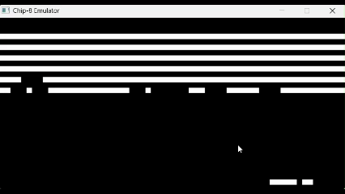

# CHIP8 Emulator
> CHIP8 Virtual Machine implementation using C and SDL2

## 🧐 About 
This project is an implementation of the CHIP8 Virtual Machine following the original CHIP8 specification. Using SDL2 to create a graphical interface for the operations taking place. Each operation is displayed in the console for debugging and the frames per second can also be controlled as well.

## 🛠 Setup

```bash
# Terminal
# Build the project
gcc -Iinc -Iinc/SDL src/main.c src/chip8operations.c src/opcode.c -Llib -lSDL2main -lSDL2 -o emulator.exe
```

## 💬 Usage
```bash
# Terminal
# Execute program
./emulator
# When prompted
<Path To ch8/bin file>
```

## 💫 Demo



## ▶ Features
- **All 35 Opcodes** #️⃣
    - Implemented all 35 of the original Chip-8's opcodes with parsing to quickly identify what code is being executed
- **Controllable FPS** 🎥
    - The number of frames per second can be controlled by removing the debug logs and adjusting the delay per frame
- **Virtual Implementation** 🖥
    - Supports the Following Specs:
        - 4096 Bytes of Memory
        - 16 8-bit Registers
        - 48 Bytes of Stack Space for subroutines
        - Hex Keyboard implementation

## :phone: Contact
Tai Williams - twilliamsa776@gmail.com
https://github.com/TWilliamsA7/EMsim/tree/main